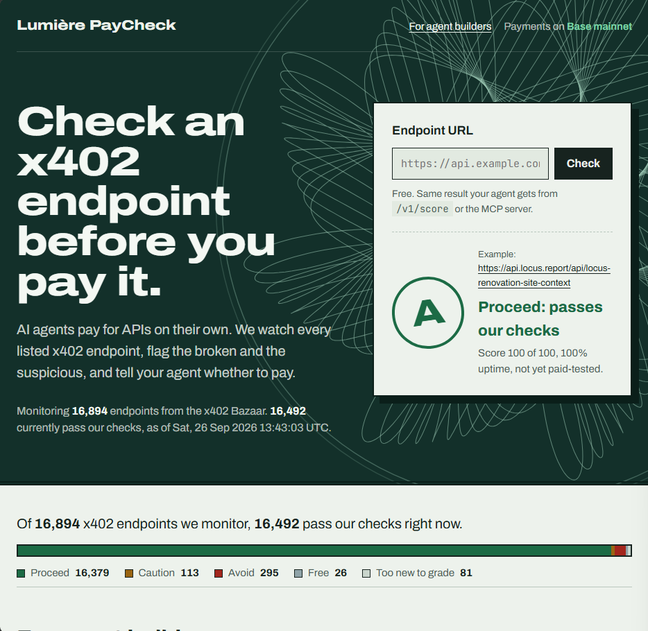
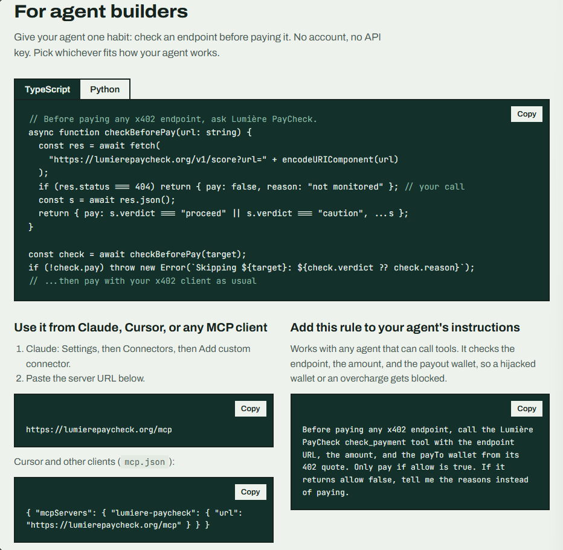
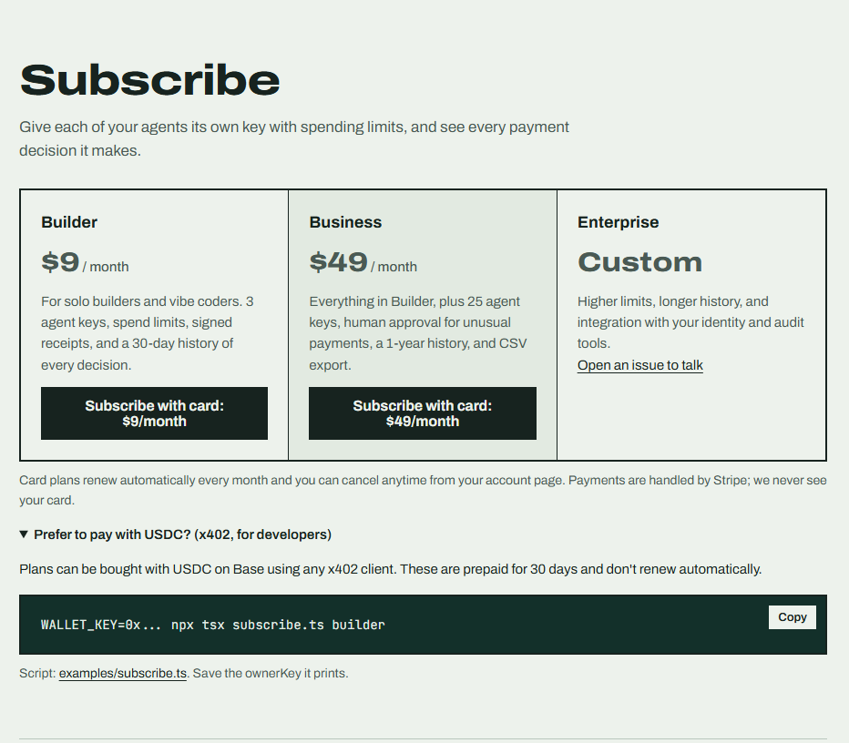
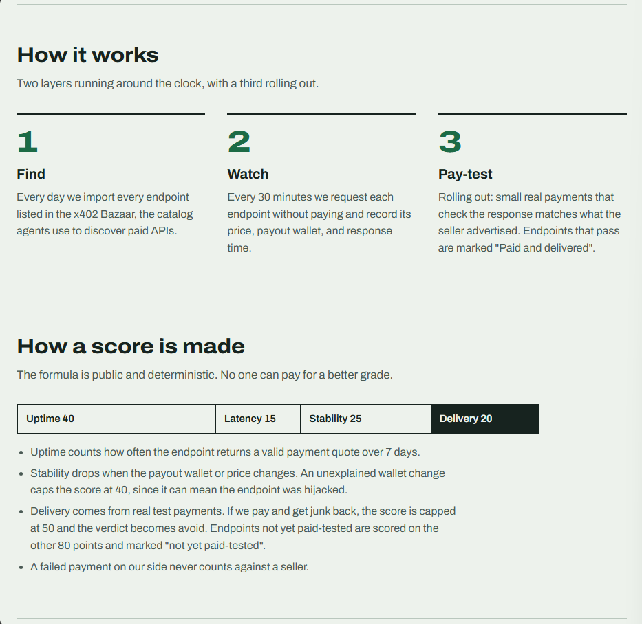
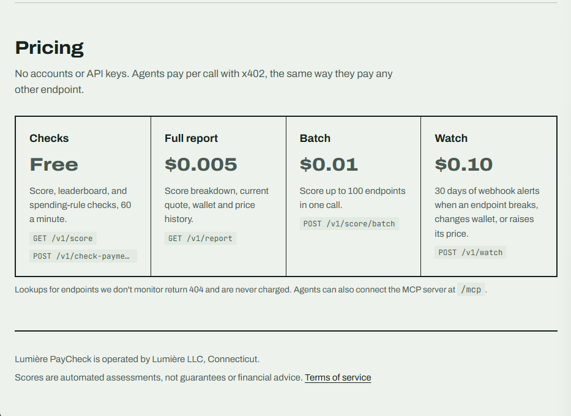

<p align="center">
  
</p>

<p align="center">
  
</p>

# Lumière PayCheck

[](https://lumierepaycheck.org) [](https://smithery.ai/servers/jahman-el/paycheck) [](https://m8ven.ai/mcp/book0feli-lumiere-paycheck-m57tub)

**Check an x402 endpoint before your agent pays it.**

AI agents now pay for APIs on their own with [x402](https://x402.org): an endpoint answers `402 Payment Required` with a price, the agent pays in USDC, and gets the data. Nothing in that flow tells the agent whether the endpoint works, whether the price is right, or whether the payout wallet is the real one.

Lumière PayCheck answers those questions. It monitors every endpoint listed in the x402 Bazaar, grades each one, and gives your agent a plain verdict: **proceed**, **caution**, or **avoid**.

🌐 **Live:** https://lumierepaycheck.org  ·  🔌 **MCP:** `https://lumierepaycheck.org/mcp`  ·  📜 [Terms](https://lumierepaycheck.org/terms)

> This repository is the public home for docs, examples, and feedback. The monitoring service itself is hosted and closed-source; the scoring formula is public (below).

---

## What it does

- **Monitors every endpoint in the x402 Bazaar** (the badge above shows the live count, which grows as new endpoints are listed) every 30 minutes: price quote, payout wallet, uptime, response time.
- **Flags hijack risk, without punishing normal rotations.** Every payout-wallet change is checked against the seller's own wallet declaration, the seller's earlier wallets, and direct transfers between the old and new wallet. Confirmed rotations don't affect the grade; unexplained changes are `avoid`, then `caution` with human review. Sellers that use a new address per request are recognized automatically. [How it works](docs/api.md#payout-wallet-changes).
- **Spending rules for agents.** Before paying, an agent asks "may I pay *this* endpoint *this* amount to *this* wallet?" and gets allow or deny with reasons.
- **Plans for teams (new).** Scoped agent keys, daily/monthly spend limits, signed receipts your wallet verifies before paying, a replayable audit trail, and human review for anomalies. [Details](docs/subscriptions.md).
- **Alerts.** Watch an endpoint and get signed webhook alerts when it breaks, changes wallet, or raises its price.
- **Paid delivery checks:** small real payments that confirm an endpoint returns what it advertises. A failure only counts if a re-test about two hours later fails too, and requests an endpoint rejects for missing input never count.
- **Known-answer tests: values, not just shape.** Uptime and schema checks can pass while an API returns the wrong number. For endpoints with a knowable answer, the verifier pays for a call with a known correct result, or compares against an independent live source, and checks the value itself. Sellers can add their own tests. [How it works](docs/api.md#known-answer-tests).
- **Real usage from on-chain data:** actual x402 payments (USDC on Base and Solana) into each endpoint's payout wallet over 30 days: volume, distinct buyers, typical and largest payment, trend, and how concentrated the buyers are, counting only payments submitted by recognized facilitators.
- **Community outcome reports:** agents that pay through us report whether calls worked. Reports only point our re-tests at problems; grades change only when our own paid test confirms. On by default, easy to opt out.

No accounts, no API keys. Free checks are free; paid features are paid per call with x402, the same way agents pay everything else.

## Quick start

### 1. From Claude, Cursor, or any MCP client

Add the remote MCP server:

```
https://lumierepaycheck.org/mcp
```

- **Claude:** Settings → Connectors → Add custom connector → paste the URL.
- **Cursor / others** (`mcp.json`):
  ```json
  { "mcpServers": { "lumiere-paycheck": { "url": "https://lumierepaycheck.org/mcp" } } }
  ```

Tools: `check_payment`, `check_endpoint`, `report_outcome`, `top_endpoints`, `catalog_stats`, `get_full_report`.

Then add one rule to your agent's instructions:

> Before paying any x402 endpoint, call the Lumière PayCheck `check_payment` tool with the endpoint URL, the amount, and the payTo wallet from its 402 quote. Only pay if `allow` is true. If it returns `allow: false`, tell me the reasons instead of paying. After paying, call `report_outcome` with the receipt and whether the response was usable.

### 2. From code

```ts
// Before paying any x402 endpoint, ask Lumière PayCheck.
const res = await fetch("https://lumierepaycheck.org/v1/check-payment", {
  method: "POST",
  headers: { "content-type": "application/json" },
  body: JSON.stringify({ url: target, amount: quote.amount, payTo: quote.payTo }),
});
const decision = await res.json();
if (!decision.allow) throw new Error(`Not paying ${target}: ${decision.reasons.join("; ")}`);
// ...then pay with your x402 client as usual
```

More in [`examples/`](examples): TypeScript, Python, curl, webhook and receipt verification, a guarded payer, and plan purchase.

<p align="center">
  
</p>

## API

| Route | Price | What it does |
|---|---|---|
| `GET /v1/score?url=` | Free | Score, grade, verdict for one endpoint |
| `POST /v1/check-payment` | Free | Spending rules: allow/deny a specific payment, with reasons |
| `GET /v1/leaderboard?limit=` | Free | Top-rated endpoints (no wallet incidents) |
| `GET /v1/stats` | Free | Catalog size and verdict counts |
| `GET /v1/operators?limit=` | Free | Sellers grouped by domain |
| `GET /v1/failures?url=` | Free | Every failed check in the last 7 days: time, result, HTTP status, and whether it counts |
| `GET /v1/wallet-changes?url=` | Free | Payout-wallet changes in the last 7 days and what the review found (declaration, seller history, on-chain link) |
| `POST /v1/declaration` | Free | Sellers: have your declared payout wallets read now |
| `GET /e?url=` | Free | Public page for one endpoint, including its failed-check log |
| `GET /badge?url=` | Free | Embeddable SVG badge |
| `GET /v1/report?url=` | $0.005 | Full report: score breakdown, current quote, wallet and price history |
| `POST /v1/score/batch` | $0.01 | Score up to 100 endpoints in one call |
| `POST /v1/watch` | $0.10 | 30 days of signed webhook alerts for one endpoint |
| `GET /v1/failures?url=` | Free | Every failed check in the last 7 days, and whether it counts |
| `GET /v1/monitor` | Free | Monitor health: what the last cycle saw, including which hosts blocked us |
| `GET /v1/plans` | Free | Plan catalog |
| `POST /v1/plans/builder` · `/business` | $9 · $49 | Buy, renew, or upgrade a plan with USDC (x402). Card: [/subscribe](https://lumierepaycheck.org/subscribe) |
| `POST /v1/authorize` | Plan | Authorize a payment with an agent key: allow / deny / review + signed receipt |

Free routes allow 60 requests per minute per client, or 300 with a [free API key](https://lumierepaycheck.org/free-key) sent in the `x-paycheck-key` header. Paid routes use x402 on **Base mainnet** (USDC). Lookups for endpoints we don't monitor return 404 and are **never charged**. Full reference: [`docs/api.md`](docs/api.md).

## Plans for teams running agents

Free checks stay free. Plans add **authorization** for agents that spend money:

| | Builder | Business | Enterprise |
|---|---|---|---|
| Price | **$9 / month** | **$49 / month** | [Talk to us privately](https://lumierepaycheck.org/enterprise) |
| Scoped agent keys (allowed sellers, per-payment cap, expiry, revoke, rotate) | 3 | 25 | Custom |
| Daily & monthly spend limits | ✅ | ✅ | ✅ |
| Signed receipts for enforcement at the tool boundary | ✅ | ✅ | ✅ |
| Replayable audit trail | 30 days | 1 year + CSV | Custom |
| Human review for anomalies (new wallets, large amounts) | — | ✅ | ✅ |

<p align="center">
  
</p>

**Subscribe on the website with a card** at [lumierepaycheck.org/subscribe](https://lumierepaycheck.org/subscribe): billed monthly by Stripe, cancel anytime, and your account is set up automatically. Then manage everything (agent keys, limits, approvals, billing) at [lumierepaycheck.org/account](https://lumierepaycheck.org/account). Developers can also pay with USDC via x402 (prepaid 30 days, no auto-renewal).

The agent calls `POST /v1/authorize` before every payment and gets **allow**, **deny**, or **review**, with reasons. On allow it gets an Ed25519-signed receipt bound to that exact payment, and [`examples/guarded-pay.ts`](examples/guarded-pay.ts) shows a payer that refuses to sign without one. Every decision can be replayed later to prove why it was made.

**Full guide:** [docs/subscriptions.md](docs/subscriptions.md) · **Subscribe:** [lumierepaycheck.org/subscribe](https://lumierepaycheck.org/subscribe) · **Pay with USDC:** [`examples/subscribe.ts`](examples/subscribe.ts)

## Verdicts

| Verdict | Meaning |
|---|---|
| `proceed` | Score ≥ 75, no wallet incidents, no failed deliveries |
| `caution` | Score 40–74, or a payout-wallet change nobody could confirm after 24 hours |
| `avoid` | Score < 40, an unexplained payout-wallet change (first 24 hours, reverted, or not a declared wallet), or a failed paid delivery |
| `free` | Serves data without asking for payment |
| `insufficient_data` | Fewer than 3 checks so far |

## How a score is made

<p align="center">
  
</p>

Deterministic and public. **No one can pay for a better grade.**

- **Uptime 40:** how often the endpoint returns a valid payment quote over 7 days
- **Latency 15:** full points at ≤ 500 ms median, zero at ≥ 3,000 ms
- **Stability 25:** drops with payout-wallet changes and price increases
- **Delivery 20:** share of paid test payments that returned what was advertised
- Not yet paid-tested → scored on the other 80 points, rescaled, and labeled so
- **Caps:** unexplained wallet change → max 40 (unconfirmed after 24 hours → max 70); failed paid delivery → max 50. Confirmed rotations and per-request addresses don't count
- A failed payment caused on our side never counts against a seller
- **Fair to sellers:** only real problems count. Checks where our monitor is rate-limited or blocked by a firewall (Cloudflare, Vercel, AWS WAF, Akamai, DataDome, Imperva, Sucuri) are `blocked`; requests the endpoint rejects before quoting (400/405/415/422) are `mismatch`; failures caused by our own network are `monitor_error`. Quotes on payment networks we can't read yet (e.g. `nano:mainnet`) are `unsupported_network`. None of these count. Network errors and 502/503/504 are retried once. We send at most 2 requests at a time and about 1 per second to any one host, and pause a host that asks us to slow down
- **Transparent:** every failed check is listed on the endpoint's public page and at `/v1/failures`, with timestamps. Our user agent is `lumiere-paycheck-prober/1.0 (+https://lumierepaycheck.org)` if you want to allowlist it

## Pricing

<p align="center">
  
</p>

## For sellers

Every monitored endpoint has a public page and a badge that updates on its own:

```markdown
[](https://lumierepaycheck.org/e?url=YOUR_ENDPOINT_URL_ENCODED)
```

**Declare your payout wallets** so a rotation is never mistaken for a hijack, and a hijack is caught on the first check: publish `{"payTo": ["0xYourWallet"]}` at `https://<your-host>/.well-known/paycheck.json` (or a DNS TXT record at `_paycheck.<your-host>`: `payto=0xYourWallet`), then `POST /v1/declaration` with your endpoint URL. [Details](docs/api.md#declaring-your-wallets-sellers).

Think a grade is wrong? [Open a Grade dispute](../../issues/new/choose) with the endpoint URL. A bot replies within a minute with the endpoint's current score and failure log, and queues a paid re-test automatically.

## Independence

Lumière PayCheck is an independent project operated by **Lumière LLC** (Connecticut, USA). It is not affiliated with Coinbase, the x402 Foundation, the Bazaar, or any seller. Scores are automated assessments, not guarantees, endorsements, or financial advice.

## Feedback

Questions, feature requests, and grade disputes: [open an issue](../../issues/new/choose) and pick the matching form. Building an agent that pays with x402? I'd love to hear what it needs.

## Documentation

Guides for evaluating and running Lumière PayCheck: [overview](https://lumierepaycheck.org/docs/overview), [features](https://lumierepaycheck.org/docs/features), [pricing](https://lumierepaycheck.org/docs/pricing), [getting started](https://lumierepaycheck.org/docs/getting-started), [administrator guide](https://lumierepaycheck.org/docs/admin-guide), [integration guide](https://lumierepaycheck.org/docs/integration), and [FAQ](https://lumierepaycheck.org/docs/faq). PDFs: [Enterprise plan guide](https://lumierepaycheck.org/docs/lumiere-paycheck-enterprise-plan-guide.pdf) (everything included) and [4-page overview](https://lumierepaycheck.org/docs/lumiere-paycheck-enterprise-overview.pdf).

## Security and privacy

What personal information we collect and who else handles it: [PRIVACY.md](PRIVACY.md) (also at [lumierepaycheck.org/privacy](https://lumierepaycheck.org/privacy)). Live usage numbers: [lumierepaycheck.org/stats](https://lumierepaycheck.org/stats). Service status and uptime: [lumierepaycheck.org/status](https://lumierepaycheck.org/status).

How keys, payments, and data are protected, including current limitations: [SECURITY.md](SECURITY.md) (also at [lumierepaycheck.org/security](https://lumierepaycheck.org/security)). Report vulnerabilities privately via [GitHub security advisories](../../security/advisories/new) or hello@lumierepaycheck.org.

## License

The documentation and example code in this repository are [MIT licensed](LICENSE). The Lumière PayCheck hosted service and its source code are not part of this repository and are not covered by this license.
