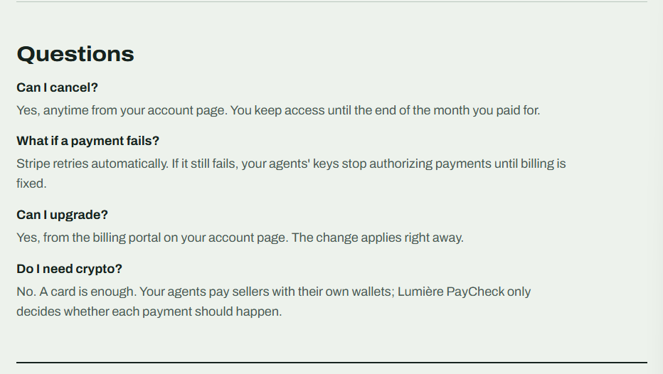

# Subscriptions: control what your agents can spend

Plans give every agent its own **scoped key**, cap what it can spend, and keep a
**replayable record of every decision**. Before paying, the agent asks
Lumière PayCheck; the answer is **allow**, **deny**, or **review**, with reasons
and (on allow) a **signed receipt** your wallet can verify before sending money.

| | Builder | Business | Enterprise |
|---|---|---|---|
| Price | $9 / month | $49 / month | Custom: [private inquiry form](https://lumierepaycheck.org/enterprise) |
| Agent keys | 3 | 25 | Custom |
| Allowed sellers, per-payment cap, daily & monthly limits, expiry, revoke, rotate | ✅ | ✅ | ✅ |
| Signed receipts (Ed25519) | ✅ | ✅ | ✅ |
| Replayable audit trail | 30 days | 1 year + CSV export | Custom |
| Human review for anomalies + signed webhook | — | ✅ | ✅ |

<p align="center">
  
</p>

**Two ways to pay:**

| | Card (most people) | USDC via x402 (developers) |
|---|---|---|
| Where | [lumierepaycheck.org/subscribe](https://lumierepaycheck.org/subscribe) | `POST /v1/plans/builder` or `/business` |
| Billing | Monthly, renews automatically (Stripe) | Prepaid 30 days, no auto-renewal |
| Cancel / change | Billing portal on your [account page](https://lumierepaycheck.org/account) | Buy again to extend or upgrade |

Requests that fail validation are never charged.

---

## 1. Subscribe

**With a card:** go to [lumierepaycheck.org/subscribe](https://lumierepaycheck.org/subscribe), pick a plan, and pay on Stripe's
secure checkout. You'll come back to a page showing your **owner key once**. Your account
is created automatically and renews every month. If a renewal fails, Stripe retries;
if you cancel, access continues to the end of the month you paid for.

**With USDC:** `POST https://lumierepaycheck.org/v1/plans/builder` (or `/business`), paid with any x402 client.
See [`examples/subscribe.ts`](../examples/subscribe.ts).

```json
{ "workspaceId": "ws_…", "plan": "builder", "expiresAt": "…",
  "ownerKey": "pc_owner_…", "important": "Save ownerKey now: it's shown only once…" }
```

- **Save the owner key.** It manages your workspace and is shown once (we store only a hash).
- **Renew or upgrade:** call the same route with `Authorization: Bearer <owner key>`.

## 2. Create an agent key

**Easiest:** open your [account page](https://lumierepaycheck.org/account), paste your owner key, and fill in the
"Create an agent key" form (limits in dollars). The page also lets you replace or revoke keys,
approve payments waiting for review, see every decision, download a CSV, and manage billing.

**Or with the API:**

```bash
curl -X POST https://lumierepaycheck.org/v1/agents \
  -H "authorization: Bearer $OWNER_KEY" -H "content-type: application/json" \
  -d '{
    "name": "research-bot",
    "allowedHosts": ["api.example.com"],
    "maxPerPayment": "50000",
    "dailyLimit": "1000000",
    "monthlyLimit": "10000000",
    "expiresInDays": 90
  }'
```

Amounts are USDC atomic units (`1000000` = $1). Every field except `name` is optional.
The response includes the **agent key** (`pc_agent_…`), shown once. Give the agent
this key, never your owner key.

| Field | Meaning |
|---|---|
| `allowedHosts` | Only these sellers can be paid. Omit to allow any monitored endpoint |
| `maxPerPayment` | Hard cap per payment |
| `dailyLimit`, `monthlyLimit` | Caps on the total the agent can spend (UTC day / month) |
| `expiresInDays` | The key stops working after this |
| `requireVerified` | Only pay endpoints that passed a paid delivery check |
| `reviewAbove` | *Business:* amounts above this go to human review |
| `reviewNewWallets` | *Business:* the first payment to a new wallet goes to review (default on) |

Manage agents: `GET /v1/agents`, `GET|PATCH|DELETE /v1/agents/:id` (DELETE revokes),
`POST /v1/agents/:id/rotate` (new key; the old one stops working immediately).

## 3. Authorize every payment

When your agent gets a `402` quote, it asks before paying:

```bash
curl -X POST https://lumierepaycheck.org/v1/authorize \
  -H "authorization: Bearer $AGENT_KEY" -H "content-type: application/json" \
  -d '{ "url": "https://api.example.com/x", "amount": "10000", "payTo": "0xSellerWallet", "network": "eip155:8453" }'
```

```json
{ "decision": "dec_…", "outcome": "allow", "reasons": ["all rules passed"],
  "receipt": "eyJ2Ijox….MEUCIQ…", "verdict": "proceed",
  "observed": { "payTo": "0x…", "amount": "10000", "network": "eip155:8453" } }
```

**Deny** happens when: the endpoint grades `avoid`; the payout wallet doesn't match
what we've monitored (possible hijack); the amount is over the agent's cap or above
the monitored price; the seller isn't in `allowedHosts`; a daily or monthly limit
would be exceeded; or the key is revoked or expired. Every reason is listed.
**Deny always beats review.**

## 4. Enforce it at the tool boundary

A decision only protects you if the payment is actually blocked when it isn't
allowed. Wrap your payer so it **refuses to sign without a valid receipt** for that
exact payment. See [`examples/guarded-pay.ts`](../examples/guarded-pay.ts).

Receipts are Ed25519-signed and bind the decision, agent, URL, amount, payTo, and
network. They expire after 5 minutes. Verify them:

- **Offline** with our public key: `GET /.well-known/paycheck-receipt-key.json`
  ([`examples/verify-receipt.ts`](../examples/verify-receipt.ts), [`examples/verify_receipt.py`](../examples/verify_receipt.py))
- **Online:** `POST /v1/receipts/verify` with `{ "receipt": "…" }`

Always check that the receipt's `amount`, `payTo`, `network`, and `url` match the
payment you're about to make.

## 5. Human review (Business)

When an agent triggers a review rule, `/v1/authorize` returns `"outcome": "review"`
and no receipt.

- **See the queue:** `GET /v1/reviews`
- **Decide:** `POST /v1/reviews/:id/approve` or `/deny`, with an optional `{ "note": "…" }`
- **Get notified:** `PATCH /v1/workspace` with `{ "reviewWebhook": "https://your-server/…" }`.
  Webhooks are signed like watch alerts: `x-paycheck-signature: sha256=` HMAC-SHA256 of the
  body keyed with `sha256(owner key)` as hex ([`examples/verify-webhook.ts`](../examples/verify-webhook.ts)).
- **The agent polls** `GET /v1/decisions/:id` (with its own key). After approval it
  returns `final: "allow"` and a receipt. Pending reviews expire after 24 hours.

## 6. Audit

- `GET /v1/decisions?agent=&final=&limit=`: the decision log
- `GET /v1/decisions/:id`: one decision with its **full context**: the request, the
  agent's policy at that moment, what monitoring observed, and spend so far
- `POST /v1/decisions/:id/replay`: re-runs the decision function on that stored
  context and confirms it produces the same outcome (`"matches": true`)
- `GET /v1/audit.csv?days=90` *(Business)*: export for your records

Decisions are kept for your plan's retention period (30 days Builder, 1 year Business).

## Workspace and billing

- `GET /v1/workspace`: plan, expiry, limits, agent count, and how it's paid (`payMethod`: `card` or `x402`)
- `PATCH /v1/workspace`: set or clear `reviewWebhook`
- `POST /billing/portal` (owner key, card plans): returns a Stripe billing-portal link to update your card, switch plans, see invoices, or cancel

## Common questions

<p align="center">
  
</p>

## Security notes

- Keys are shown once and stored only as SHA-256 hashes. Treat them like passwords.
- Agent keys can't manage the workspace; owner keys can't authorize payments.
- If a key leaks, rotate or revoke it immediately.
